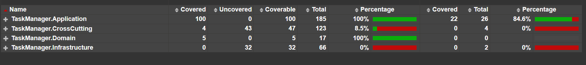

# TaskManager API

Sistema de Gestão de Tarefas desenvolvido em .NET 8, aplicando princípios de Clean Architecture, SOLID e cobertura total de testes automatizados. O objetivo é oferecer uma API RESTful robusta, com foco em boas práticas de desenvolvimento e facilidade de manutenção.

## Sumário
- [Tecnologias Utilizadas](#tecnologias-utilizadas)
- [Arquitetura](#arquitetura)
- [Funcionalidades](#funcionalidades)
- [Validações Adicionais](#validações-adicionais)
- [Como Executar o Projeto](#como-executar-o-projeto)
- [Testes e Cobertura](#testes-e-cobertura)
- [Exemplos de Requisição e Resposta](#exemplos-de-requisição-e-resposta)


---

## Tecnologias Utilizadas
- .NET 8
- Entity Framework Core (InMemory)
- Swagger (Swashbuckle)
- xUnit + Moq
- Coverlet + ReportGenerator

---

## Arquitetura
O projeto foi desenvolvido seguindo os princípios da **Clean Architecture**, separando responsabilidades em camadas bem definidas:

```
TaskManager
|
|-- TaskManager.API              // Camada de apresentação (Controllers, Validadores, Program.cs)
|-- TaskManager.Application      // Regras de negócio (Services, DTOs)
|-- TaskManager.Domain           // Entidades e contratos (Entities, Interfaces, Enums)
|-- TaskManager.Infrastructure   // Persistência de dados (DbContext, Repositories)
|-- TaskManager.CrossCutting     // Middleware, Responses e Exceptions customizadas
|-- TaskManager.Tests            // Testes unitários (xUnit + Moq)
```

> **Nota:** Não foi utilizado AutoMapper com o objetivo de manter a clareza na transformação entre entidades e DTOs, evitando abstrações desnecessárias para um projeto de pequeno porte.

---

## Funcionalidades
- Criar tarefa
- Listar tarefas
  - Com filtros opcionais de status e intervalo de datas
- Atualizar tarefa
- Excluir tarefa

### Status permitidos
- `Pending`
- `InProgress`
- `Completed`

---

## Validações Adicionais
- **Data de vencimento não pode ser no passado**
- **Filtro por data de vencimento e intervalo de datas**: adicionados para melhorar a usabilidade e organização das tarefas, mesmo não sendo uma exigência do desafio.

---

## Como Executar o Projeto
1. Clone o repositório:
   ```bash
   git clone https://github.com/Eriberto-lab/TaskManager.git
   ```

2. Acesse a pasta da solução:
   ```bash
   cd TaskManager
   ```

3. Execute a API:
   ```bash
   dotnet run --project TaskManager.API
   ```

4. Acesse a documentação Swagger:
   [http://localhost:7085/swagger](https://localhost:7085/swagger/index.html) *(ajustar porta conforme aplicação)*

---

## Testes e Cobertura
1. Execute os testes:
   ```bash
   dotnet test /p:CollectCoverage=true
   ```

2. Gere o relatório de cobertura:
   ```bash
   reportgenerator -reports:TaskManager.Tests/coverage.cobertura.xml -targetdir:coveragereport -reporttypes:Html
   ```

3. Abra o arquivo gerado em:
   ```
   coveragereport/index.html
   ```

> ## Cobertura de Testes

Este projeto possui testes automatizados com foco na camada `Application`, onde se concentram as regras de negócio.

> ✅ 100% de cobertura na camada `Application`.

### 📊 Relatório de Cobertura



*Relatório gerado com Coverlet e ReportGenerator*


---

## Exemplos de Requisição e Resposta

### Criar Tarefa (POST /api/tasks)
**Request:**
```json
{
  "title": "Estudar Clean Architecture",
  "description": "Revisar conceitos de camada e responsabilidades",
  "dueDate": "2025-04-10T00:00:00"
  
}
```
**Response:**
```json
Status: 201 Created

```

### Listar Tarefas com Filtro (GET /api/tasks?status=Pending&startDate=2025-04-01&endDate=2025-04-10)
**Response:**
```json
[
  {
    "id": 1,
    "title": "Estudar Clean Architecture",
    "description": "Revisar conceitos de camada e responsabilidades",
    "dueDate": "2025-04-10T00:00:00",
    "status": "Pending"
  }
]
```


---

## ✅ Atendimento aos Requisitos do Desafio

### Funcionalidades da Aplicação

| Requisito                                                                                      | Status | Observação                                                       |
| ---------------------------------------------------------------------------------------------- | ------ | ---------------------------------------------------------------- |
| Criar nova tarefa com título (obrigatório), descrição e data de vencimento (opcional) e status | ✅      | Implementado com DTO, validação e enum para status               |
| Retornar um código único para cada tarefa criada                                               | ✅      | ID é gerado automaticamente (GUID)                               |
| Visualizar todas as tarefas                                                                    | ✅      | Endpoint de listagem implementado                                |
| Filtrar tarefas por status e/ou data de vencimento                                             | ✅      | Adicionado inclusive filtro por intervalo de datas como melhoria |
| Editar uma tarefa existente (título, descrição, status, vencimento)                            | ✅      | Totalmente funcional                                             |
| Excluir uma tarefa                                                                             | ✅      | Endpoint implementado                                            |

### Requisitos Técnicos

| Requisito                                        | Status | Observação                                                                   |
| ------------------------------------------------ | ------ | ---------------------------------------------------------------------------- |
| Usar .NET 6 ou superior                          | ✅      | Projeto usa .NET 8                                                           |
| Aplicação dos princípios SOLID                   | ✅      | Aplica Clean Architecture, uso de interfaces, SRP, DI                        |
| Uso do Entity Framework Core com InMemory        | ✅      | EF Core com banco InMemory configurado                                       |
| API seguindo padrão RESTful                      | ✅      | Métodos HTTP bem definidos com URIs claras                                   |
| Uso do Swagger para documentar a API             | ✅      | Swagger configurado com `Swashbuckle.AspNetCore`                             |
| Validações de entrada de dados                   | ✅      | DTOs validados com `FluentValidation`                                        |
| Testes automatizados com xUnit ou NUnit          | ✅      | Testes feitos com xUnit, 100% de cobertura na camada Application             |
| DTOs para comunicação entre camadas              | ✅      | DTOs utilizados para entrada/saída da API                                    |
| Status HTTP adequados (200, 201, 400, 404, etc.) | ✅      | Implementado corretamente                                                    |
| Estrutura modular com separação por camadas      | ✅      | Clean Architecture aplicada: API, Application, Domain, Infrastructure, Cross |
| Injeção de dependência (Dependency Injection)    | ✅      | DI configurada no `Program.cs`                                               |
| Tratamento de erros adequado                     | ✅      | Middleware global para tratamento de exceções implementado                   |
| Logging básico                                   | ✅      | Utilizado `ILogger<T>` com injeção de dependência                            |
| Documentação clara no README                     | ✅      | README detalhado com instruções, arquitetura, exemplos, etc.                 |

### Melhorias Adicionais

| Funcionalidade extra                                  | Benefício                                                         |
| ----------------------------------------------------- | ----------------------------------------------------------------- |
| Filtro por intervalo de datas                         | Permite uma busca mais precisa e útil para relatórios ou análises |
| Validação de tarefas com data no passado              | Evita erros de lógica e mantém integridade do sistema             |
| Estrutura com subpastas e divisão organizada          | Escalabilidade e manutenibilidade do projeto                      |
| Middleware de erro personalizado                      | Centraliza o tratamento e retorno de mensagens amigáveis          |
| Relatório de cobertura com Coverlet + ReportGenerator | Permite avaliar qualidade dos testes e pontos a melhorar          |

---


